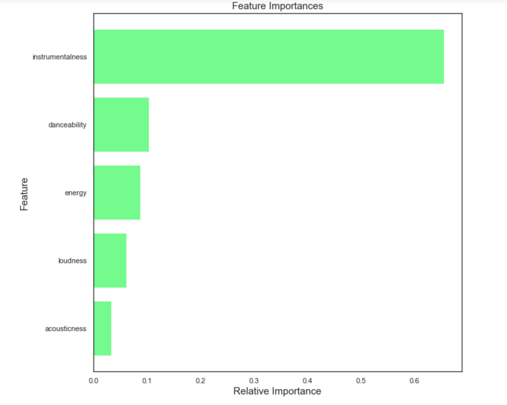

# Spotify Hit Songs Classification
## Business Problem
There could be a number of factors that determine whether a song will be a hit or not. If we know what these factors are, we may be able to better predict how popular a song will be and therefore improve features such as user recommendations.

By looking at Spotify data, can we use certain features to predict whether or not a song will be a hit? What features are most predictive of hit songs?

## Data Understanding
To begin, I import all the neccessary tools I will need for this project as well as the dataset I will be working with. I also explore the dataset to get a better understanding of the data it contains.

The dataset contains 6,398 Spotify songs from the 2010s. Exactly half of these songs are hits and half are not.

To get a general idea of what features might be related to the target, I performed a Pearson correlation. From this I found that the most positively correlated features with the target were danceability, loudness, valence, and time signature. Instrumentalness had the strongest negative correlation with the target.

    
## Data Preparation
To compare later models to, first a baseline model must first be created.
I created a train-test split to evaluate the models with and then normalized the training data.

After creating various models including a decision tree, K nearest neighbors, and a logistic regression model (see miscellaneous notebook), I determined that the single decision tree performed the best and would be used as the baseline model.

## Modeling
In this section I build and evaluate my baseline decision tree model, then make changes to that model as well as try a more complex model (random forests) to see if it will perform better at correctly classifying the songs as hits or not.

For this business problem, we have a goal of recommending hit songs to Spotify users and therefore it would be better to incorrectly identify a hit song as not a hit, than to incorrectly identify a song as a hit when it isn't one. In other words, a false negative from our model is better than a false positive. We want to only recommend good-quality songs. For these reasons, the metrics used to evaluate the following models include accuracy, precision, and AUC.

The baseline model had a testing accuracy score of about 79.8% and a testing precision score of about 78.1%. It also had an AUC value of about 0.80.
The most important features to this baseline model were instrumentalness, energy, loudness, valence, and danceability.
Hyperparameter tuning did not improve this model.

The final and best-performing model is a random forests model with a testing accuracy of about 82.4%, a testing precision of about 79.0%, and an AUC of about 0.82.

The most important features for this model are instrumentalness, danceability, energy, loudness, and acousticness. These are mostly the same features that were most important to our baseline model, except acousticness is more important here.

    

## Evaluation
Our final model is about 82.4% accurate and about 79.0% precise in correctly identifying songs as hits or not. The AUC was about 0.82.

The AUC value indicates that there are more false negatives than false positives in this model's results, which is what we want. This means we are less likely to recommend a song that is not actually a hit.

This confusion matrix shows that the model had 185 false negatives and 97 false positives.

## Conclusion
##### Recommendations:
Hit songs should have the following features:
- Danceability
- Energy
- Loudness
- Acousticness 

Songs should not be too high in instrumentalness, because it is highly correlated with a song <em>not</em> being a hit.

##### Next Steps:
- Compare data from other decades
    - Are there any trends?
- Investigate whether genre is an important feature when determining whether or not a song will be a hit
